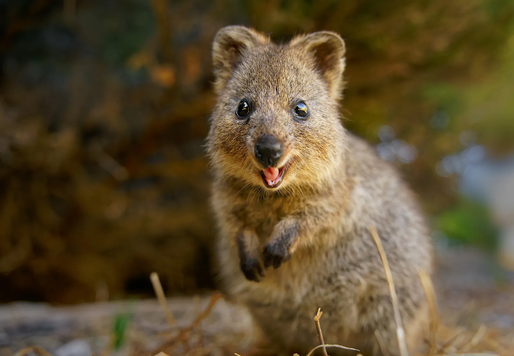
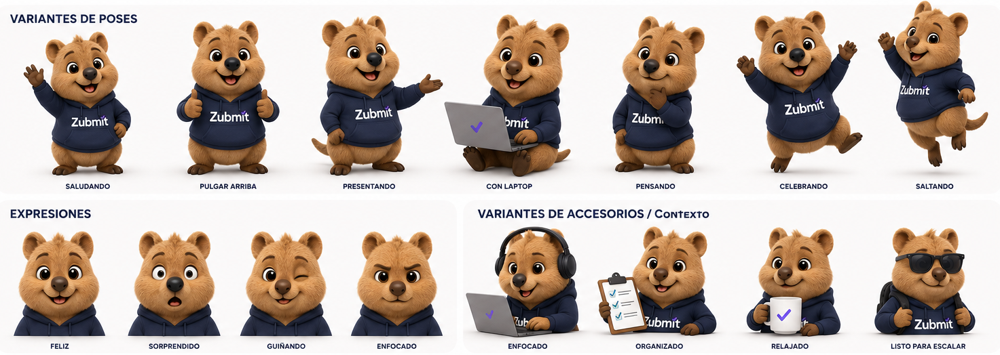

Cuando comencé a construir Zubmit, nunca pensé que terminaría diseñando una mascota.

Mi enfoque estaba en resolver problemas técnicos: crear una plataforma de formularios headless rápida, confiable y fácil de integrar. Pasaba más tiempo pensando en APIs, colas de procesamiento y webhooks que en branding.

Pero a medida que el proyecto fue creciendo, empecé a notar algo.

Las mejores empresas de tecnología no solo construyen productos. También construyen una identidad.

Muchas veces recordamos una marca no por una característica específica, sino por cómo nos hace sentir. Algunas tienen una voz única. Otras tienen una estética reconocible. Algunas incluso tienen personajes que terminan convirtiéndose en parte de la empresa.

Fue entonces cuando me pregunté:

¿Y si Zubmit tuviera una mascota?

## El desafío de crear algo memorable

En internet existen miles de herramientas para desarrolladores, y la mayoría compiten con características similares: más velocidad, más integraciones, más funcionalidades... Pero pocas logran transmitir personalidad, y yo quería que Zubmit se sintiera cercano, amigable y confiable.

No quería que fuera simplemente "otra API de formularios", queria crear algo que la gente pudiera recordar.

## Por qué elegí un quokka

Después de explorar muchas ideas terminé eligiendo al Quokka es uno de los animales más curiosos que existen y tambien uno de mis animales favoritos.

Si nunca has visto uno, probablemente deberías buscarlo igual te dejo una fotito por aqui:

Son conocidos como los animales más felices del mundo. Siempre parecen estar sonriendo.

Inmediatamente me parecio perfectos para representar lo que quería transmitir con Zubmit:

* Simplicidad.
* Confianza.
* Cercanía.
* Optimismo.

Además, me gustó el contraste.

Detrás de Zubmit existe una infraestructura compleja, pero la experiencia para el usuario debería sentirse simple y amigable.

El Quokka representaba exactamente esa idea.

## Cómo utilicé inteligencia artificial para darle vida

Una de las partes más interesantes de este proceso es que no diseñé a Zuby desde cero, al menos no de la forma tradicional. Aunque tengo conocimientos básicos de diseño y dibujo, no soy ilustrador profesional. Tenía una idea bastante clara de lo que quería transmitir, pero necesitaba una forma de convertir esa visión en algo tangible.

Fue entonces cuando decidí apoyarme en la inteligencia artificial. Utilicé ChatGPT para explorar conceptos, definir la personalidad del personaje, desarrollar su historia y generar múltiples versiones visuales hasta encontrar una identidad que realmente representara a Zubmit. Durante varios días fui refinando prompts, ajustando detalles, corrigiendo expresiones, modificando colores, mejorando proporciones y construyendo una línea gráfica coherente.

Lo más interesante es que la inteligencia artificial no reemplazó el proceso creativo; lo amplificó. Me permitió iterar mucho más rápido, probar alternativas y explorar ideas que probablemente nunca habría considerado por mi cuenta. Cada versión fue el resultado de cientos de pequeñas decisiones humanas apoyadas por herramientas de IA, combinando creatividad, criterio y experimentación hasta dar vida a un personaje que hoy forma parte de la identidad de Zubmit.

siendo esta la version final:

## ¡Así nació Zuby!

Después de varias pruebas nació Zuby, un personaje inspirado en un Quokka que vive en el mundo digital y cuya misión es ayudar a que los formularios lleguen siempre a su destino. No quería crear una historia complicada ni un lore difícil de seguir; buscaba algo simple, fácil de entender y alineado con el propósito del producto. La idea era sencilla: cada vez que alguien envía un formulario, Zuby se encarga de que llegue exactamente a donde debe llegar. Esa pequeña misión representa perfectamente lo que hace Zubmit detrás de escena.

## Lo que aprendí durante el proceso

Crear una mascota me enseñó algo que no esperaba: el branding no se trata únicamente de logos, colores o tipografías. Se trata de construir algo con lo que las personas puedan conectar. A medida que desarrollaba a Zuby, me vi obligado a pensar en aspectos que normalmente no aparecen cuando estás escribiendo código: ¿cómo habla?, ¿cómo se comporta?, ¿qué valores representa? Poco a poco entendí que una marca no es solo lo que muestra visualmente, sino también la personalidad que transmite en cada interacción.

Este proceso también fue una demostración personal de cómo la inteligencia artificial puede potenciar la creatividad. Muchas veces se habla de la IA como una herramienta para automatizar tareas, pero en mi caso se convirtió en una herramienta para crear. No diseñó la visión por mí ni tomó las decisiones importantes; simplemente me ayudó a explorar posibilidades, acelerar la experimentación y dar forma a ideas que solo existían en mi cabeza. Al final, Zuby no nació de la inteligencia artificial ni únicamente de mi imaginación, sino de la combinación de ambas: una idea humana apoyada por una herramienta capaz de convertir conceptos abstractos en algo tangible.

## Más allá de una simple ilustración

Hoy Zuby forma parte de la identidad de Zubmit. Aparece en la landing page, en futuros materiales de marketing y, con toda seguridad, seguirá evolucionando junto con el producto a medida que este crezca. Es posible que algunos usuarios nunca presten demasiada atención a la mascota, y eso está perfectamente bien. Pero para quienes sí lo hagan, espero que Zuby transmita la misma idea que me motivó a crearlo desde el principio: que la tecnología puede ser poderosa sin dejar de ser amigable.

Al final, Zuby representa mucho más que un personaje. Representa la filosofía detrás de Zubmit: hacer que algo tan técnico como el procesamiento de formularios sea simple, confiable y humano. Porque detrás de cada formulario enviado hay una persona intentando comunicarse, una oportunidad de negocio, una solicitud importante o un mensaje que necesita llegar a su destino. Y si Zuby logra recordar aunque sea un poco esa idea, entonces habrá cumplido perfectamente su misión.

## Reflexión final

Crear software es divertido. Resolver problemas, diseñar arquitecturas y ver cómo una idea se convierte en una aplicación funcional tiene algo profundamente satisfactorio. Sin embargo, con este proyecto aprendí que crear un mundo alrededor de ese software es lo que realmente hace que un producto cobre vida. Los usuarios pueden olvidar características, tecnologías o incluso nombres de funciones, pero suelen recordar las historias, las emociones y las experiencias que una marca les transmite.

También comprendí que estamos viviendo un momento único para quienes construimos productos de forma independiente. Gracias a herramientas como ChatGPT y otras soluciones basadas en inteligencia artificial, hoy es posible transformar una simple idea en una marca completa, con personalidad, narrativa, personajes e identidad visual, sin necesidad de contar desde el primer día con un equipo entero de diseñadores, ilustradores o creativos. La IA no reemplaza la visión, pero sí reduce enormemente la distancia entre imaginar algo y hacerlo realidad.

Zuby nació precisamente de esa combinación: una idea, mucha curiosidad y las herramientas adecuadas para darle forma. Y aunque comenzó como una simple mascota para acompañar a Zubmit, terminó convirtiéndose en un recordatorio de algo más importante: las mejores herramientas no solo resuelven problemas, también cuentan historias.

