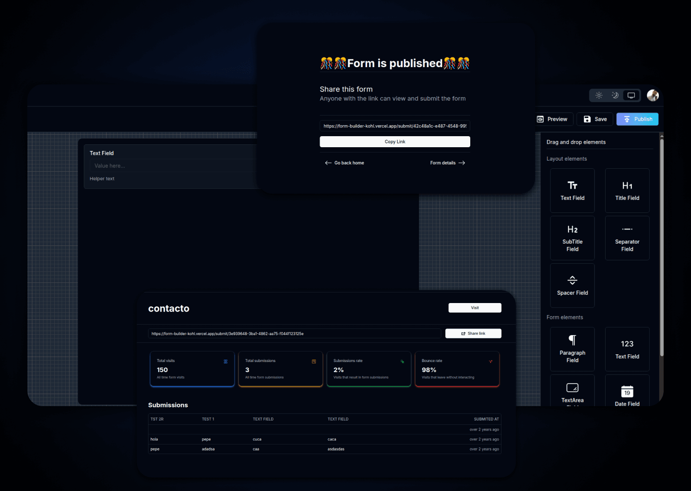
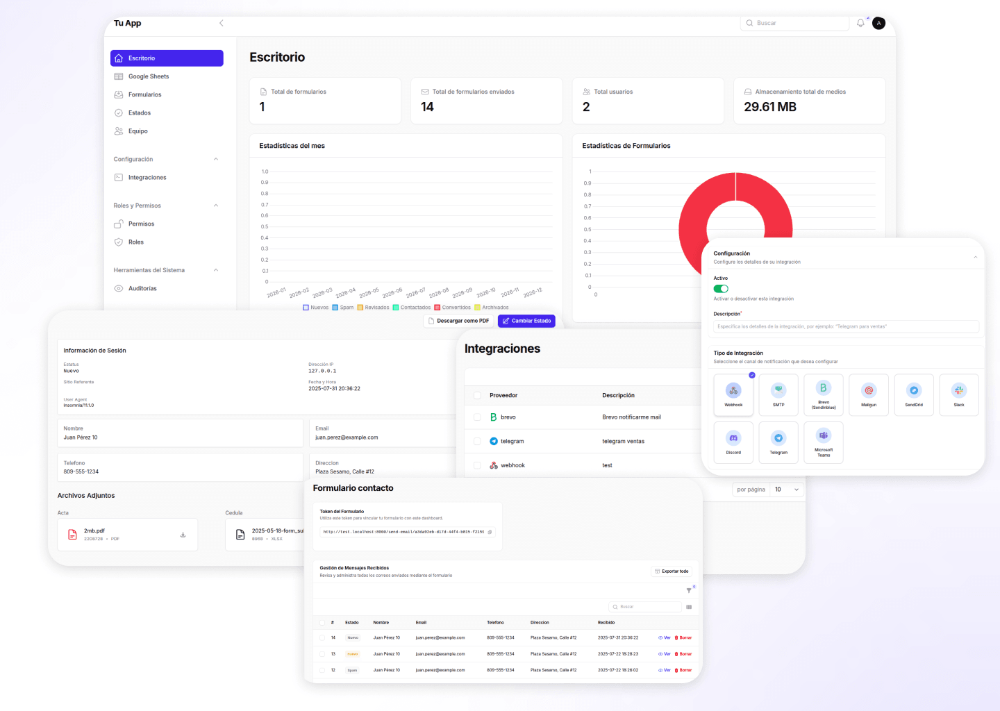
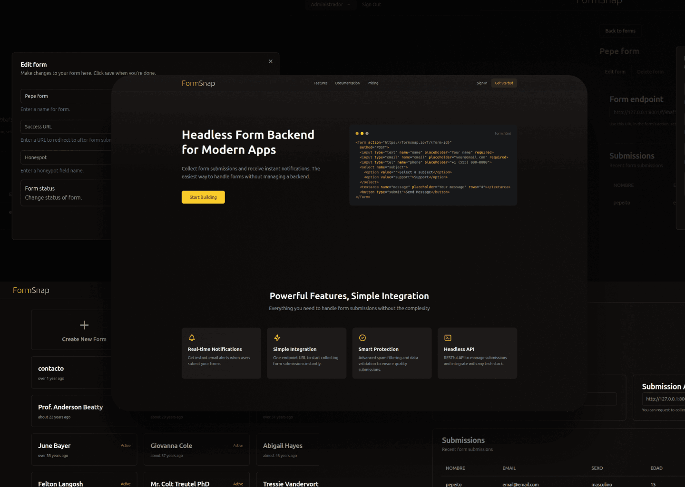
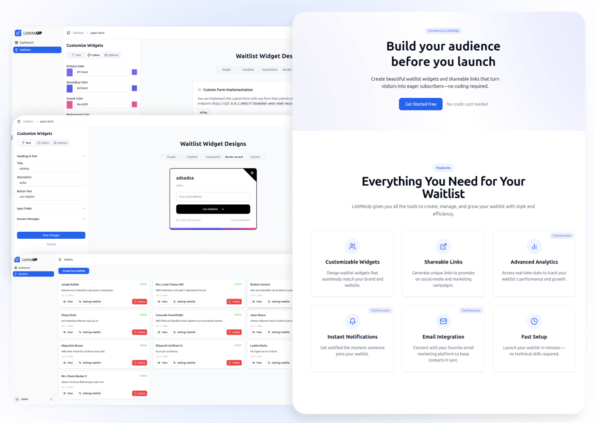
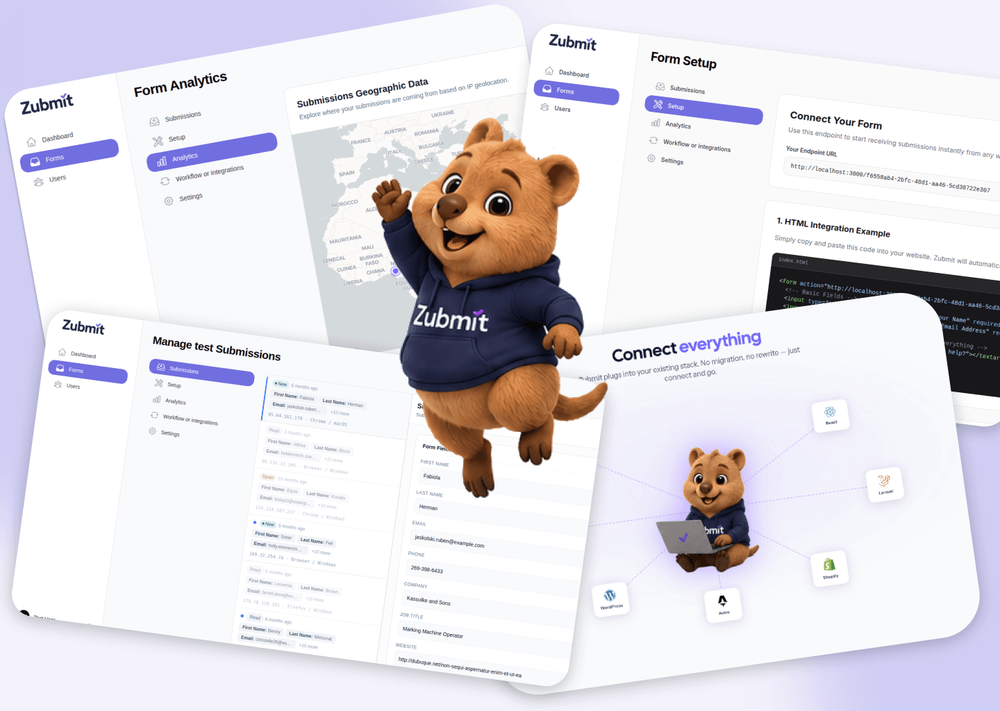

Si alguna vez has intentado construir un producto desde cero, sabes que la línea entre "esto va a cambiar el mundo" y "voy a borrar este repositorio" es muy fina. 

Hoy quiero abrir las puertas de la cocina y contarles una historia muy personal sobre cómo pasé los últimos dos años iterando, tirando código a la basura y aprendiendo a base de golpes hasta llegar a <a href="https://zubmit.net" target="_blank" rel="noopener noreferrer">Zubmit</a>, mi plataforma definitiva de *Headless Forms*.

Si eres desarrollador, te prometo que te vas a sentir identificado con este ciclo de sobre-ingeniería y redención.

## 1. El Inicio: La Trampa del Constructor Visual (Noviembre 2023)

Como muchos, empecé con una ambición desmedida: "Voy a construir el mejor creador de formularios visual del mercado". En noviembre de 2023 lancé mi primer prototipo usando **Next.js 14, Prisma, PostgreSQL y TailwindCSS**. 

Me obsesioné con la interfaz. Programé un diseñador *drag-and-drop* usando la librería `dnd-kit`. Tenía bloques de texto, selectores, separadores, validaciones y previsualizaciones en tiempo real usando Server Actions. Me sentía invencible.

**El golpe de realidad:** Mantener un editor visual es una pesadilla de estados y CSS. Además, me di cuenta de algo crucial: los desarrolladores *odian* los iframes y los diseños forzados. Ellos quieren escribir su propio HTML y que alguien más se encargue del backend.

## 2. El Monstruo Corporativo: rcmail (Marzo 2024)

Decidí que el problema no era el formulario, sino el ecosistema. Hice un cambio de stack radical hacia **PHP y Laravel**, y me fui al extremo opuesto. Así nació **rcmail**, una plataforma BaaS (*Backend-as-a-Service*) pensada para agencias y corporaciones.

Aquí mis habilidades de arquitectura dieron un salto enorme:

- **Arquitectura Multi-Tenant real:** Construí un sistema donde una agencia podía gestionar múltiples clientes bajo una misma infraestructura de manera segura con base de datos separadas por tenant y paneles de administración duales (uno Súper Admin global y otro por inquilino).
- **RBAC Granular:** Implemente roles y permisos complejos (Súper Admin, Admin, Editor, Coordinador, Visor) para que los clientes pudieran ver leads sin romper configuraciones.
- **Integraciones a medida:** Programé un servicio de sincronización en tiempo real con Google Sheets usando OAuth2, además de webhooks, Slack, Telegram, Brevo, ActiveCampaign, Mailchimp, Discord y más.
- **Preparado para facturar:** Lo conecté con Stripe y añadí un sistema de auditoría para registrar cada movimiento posible.

El golpe de realidad (o, si se prefiere, de ironía corporativa): **rcmail** era técnicamente tan sólido que llegué a proponer su adopción en mi empresa donde trabajo actualmente. La idea gustó. De hecho, gustó tanto que, en lugar de respaldar el proyecto original, decidieron desarrollar una versión propia internamente, impulsarla con todos los recursos disponibles y convertirla en un producto que hoy monetizan con bastante éxito.

Fue una lección interesante: a veces la mejor validación de una idea no llega en forma de inversión, reconocimiento o apoyo, sino cuando otros deciden construir algo muy parecido después de verla funcionar.

Sin embargo, no hay espacio para el resentimiento. El mercado es enorme, las oportunidades abundan y cada proyecto tiene su momento. Al final, me quedo con la satisfacción de haber demostrado que la visión era correcta desde el principio. Mi momento de brillar simplemente estaba en otro lugar.

## 3. Desnudando el Producto: FormSnap (Junio 2024)

Buscando simplificar la experiencia y alejándome de la complejidad innecesaria, decidí volver a las bases. En junio de 2024 inicié **FormSnap**.

La premisa era brutalmente simple: toma esta URL, ponla en el `action` de tu formulario HTML, y nosotros nos encargamos del resto. Sin constructores visuales, sin multi-tenancy masivo. Usé un stack híbrido con **Blade, TailwindCSS, React y TypeScript** en el frontend, manteniendo Laravel para el panel de usuario.

¡Funcionaba! La aproximación headless era exactamente lo que los desarrolladores querían. FormSnap demostró ser la arquitectura correcta y, de hecho, se terminó convirtiendo en el núcleo del producto final. Sabía que eventualmente tendría que mejorar el motor para soportar picos de tráfico, pero antes de dar ese salto, decidí ganar experiencia con un caso de uso más enfocado.

## 4. El Desvío de Nicho: listmeup (Febrero 2025)

Mientras maduraba la idea, a principios de 2025 tomé un pequeño desvío y creé **listmeup**, una herramienta enfocada 100% en captar *leads* para listas de espera (*waitlists*). 

Me sirvió muchísimo para entender a fondo la psicología de la conversión y cómo lidiar con analíticas muy específicas, pero mi corazón seguía en la infraestructura pura.

## 5. El Clímax Técnico: Zubmit (Hoy 2026)

Y así llegamos a **Zubmit**. 

Zubmit es la evolución final. Tomé la simplicidad de FormSnap y la madurez arquitectónica de rcmail, pero resolví el problema más grande de un BaaS de formularios: **el rendimiento ante picos masivos de tráfico**.

Así que rediseñé el núcleo:

**Arquitectura Híbrida:** Construí un microservicio ultra-rápido exclusivamente para la ingesta de datos. Este servicio atrapa las solicitudes en milisegundos y las encola a través de una cola de trabajos en base a la DB. Luego, procesos en background consumen los datos a su propio ritmo sin tirar el sistema.

**Motor de Analíticas Brutal:** Escribí mi propio script CDN para capturar parámetros UTM automáticamente. Para que el panel de administración no colapsara calculando métricas de miles de solicitudes, implementé tareas que pre-calculan agregaciones diarias. Además, mejoré la resolución de IPs para geolocalizar leads con precisión milimétrica.

**Obsesión por la Experiencia y el Detalle:** 
Para coronar esta arquitectura, decidí que Zubmit no solo debía ser rápido, sino sentirse como un producto premium y maduro. Distribuí el proyecto cuidadosamente:
- **Distribución Inteligente:** En lugar de un monolito pesado, dividí las responsabilidades. Tenemos el microservicio de ingesta súper ligero por un lado y la aplicación principal (panel y analíticas) en contenedores separados para escalar de forma independiente.
- **UI/UX Refinado:** Me enfoqué meticulosamente en la experiencia visual dentro del panel. Diseñé la vista de solicitudes para que tenga ese *look* premium de una bandeja de entrada de correo moderna (tipo *inbox*). Refiné la tipografía y los espacios de cada tarjeta para que revisar los datos de tus *leads* sea una experiencia limpia, súper familiar y placentera.
- **Branding y la Mascota:** Quería dejar atrás la vibra de "herramienta aburrida". Le di a Zubmit un rostro y una personalidad creando mi propia mascota, logrando una marca mucho más humana y reconocible (puedes leer la historia y la decisión de cómo nació [Zuby](/blog/como-utilice-chatgpt-para-crear-la-mascota-de-mi-saas)).

### Reflexión Final

Pasé de intentar domar un editor visual reactivo, a construir un gigante corporativo, hasta finalmente encontrar el equilibrio perfecto: un sistema que alimenta de forma fluida a un ecosistema de gestión impecable.

Si estás cansado de reinventar la rueda configurando bases de datos, validaciones, servidores de correo y filtros de spam solo para hacer funcionar un formulario web, dale una oportunidad a **<a href="https://zubmit.net" target="_blank" rel="noopener noreferrer">Zubmit</a>**. 

Es el producto que me habría gustado tener hace dos años. 🚀
