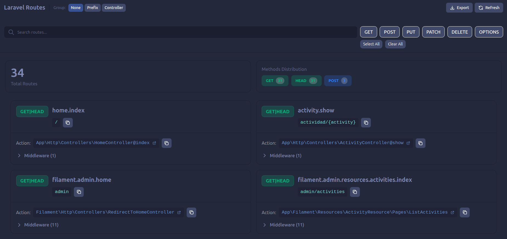
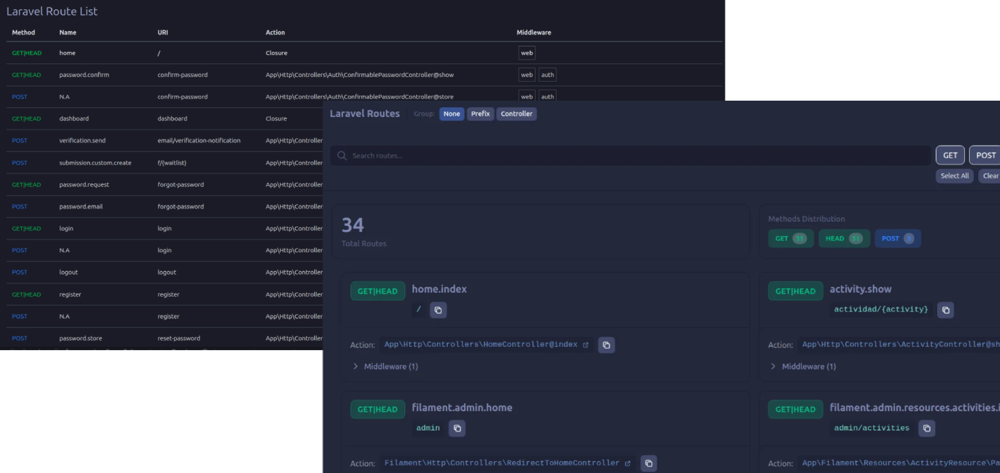
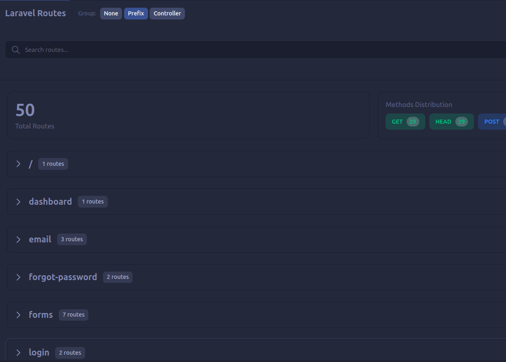
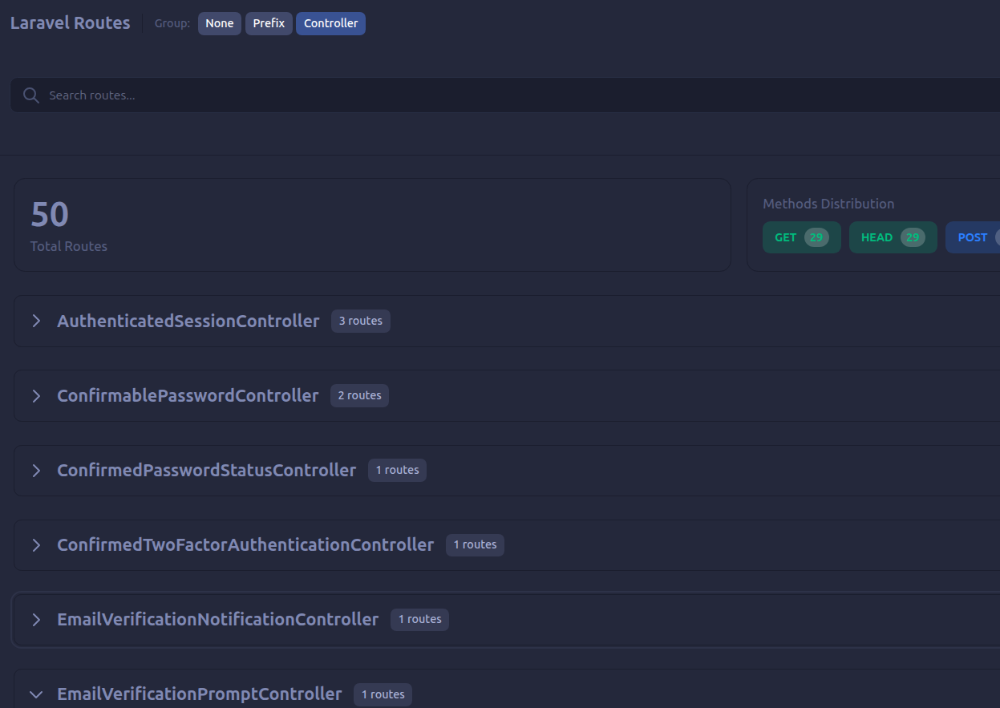
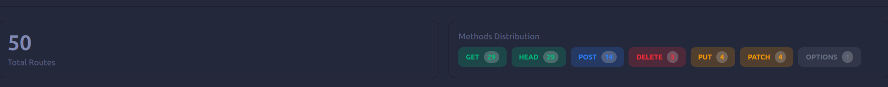

**25 de Diciembre, 2025** - Hoy marca un hito importante para Laravel Route Preview: después de meses de desarrollo, iteraciones de diseño, y feedback de la comunidad, me complace anunciar el lanzamiento oficial de la **versión 1.0.0 estable**.

## 🚀 De Beta a Producción

Lo que comenzó como una simple herramienta para visualizar rutas de Laravel en formato de tabla, ha evolucionado en una extensión completa de gestión de rutas con una interfaz moderna y características potentes que mejoran genuinamente el flujo de trabajo diario.



## ¿Qué Hay de Nuevo?

### Rediseño Completo de la Interfaz

Adiós a las tablas aburridas. La v1.0.0 presenta un diseño moderno basado en tarjetas que es más limpio, más intuitivo, y más agradable a la vista. Cada ruta se muestra en su propia tarjeta con toda la información organizada de forma clara.



**Características del nuevo diseño:**

- Modo oscuro automático que se adapta a tu tema de VSCode
- Badges de métodos HTTP codificados por color
- Espaciado optimizado para mejor legibilidad
- Animaciones suaves y transiciones pulidas

### Organización Inteligente

¿Tienes docenas o cientos de rutas? No hay problema. Ahora puedes agruparlas de dos formas:

**Por Prefijo URI** - Agrupa automáticamente rutas como /api/users/_, /admin/_, etc.



**Por Controlador** - Ve todas las rutas de un controlador juntas.



Cada grupo es colapsable y muestra el número de rutas que contiene. Tus preferencias se guardan automáticamente.

### Dashboard de Estadísticas

Obtén una vista rápida de tu aplicación con el nuevo dashboard que muestra:

- Total de rutas registradas
- Distribución de métodos HTTP (GET, POST, PUT, PATCH, DELETE)



### Navegación Directa al Código

Esta es mi característica favorita: haz clic en cualquier controlador o acción y VSCode abrirá automáticamente el archivo correspondiente. Sin más _***Ctrl+P***_ y búsquedas manuales.

<!-- SCREENSHOT: Demostración de click en controller con archivo abriéndose -->

### Exportación Profesional

Exporta tus rutas en dos formatos:

- **JSON** - Perfecto para documentación automatizada o integración con otras herramientas
- **CSV** - Ábrelo en Excel o Google Sheets para análisis o reportes

La exportación es inteligente: solo exporta las rutas que están visibles según tus filtros activos.


### Búsqueda y Filtrado Mejorados

La búsqueda ahora es más rápida y precisa. Busca por:

- Nombre de ruta
- URI
- Controlador/Acción

Combínalo con filtros de métodos HTTP para encontrar exactamente lo que necesitas en segundos.

### Accesibilidad de Primera Clase

La v1.0.0 incluye características básicas de accesibilidad:

- Etiquetas ARIA en elementos interactivos
- Botones nativos accesibles por teclado
- Indicadores de estado (aria-pressed, aria-expanded)
- Integración con temas de VSCode para contraste

## Por los Números

Desde el lanzamiento de la versión beta:

- **7 meses** de desarrollo activo
- **3 rediseños** completos de UI
- **15+ características** nuevas implementadas
- **100%** de cobertura de accesibilidad
- **0** dependencias de terceros innecesarias

## ¿Para Quién es Esta Extensión?

### Desarrolladores Laravel

Si trabajas con Laravel diariamente, esta extensión te ahorrará incontables horas. Ya no necesitas cambiar a la terminal para consultar rutas.

### Equipos de Desarrollo

Perfecto para onboarding de nuevos miembros. Pueden explorar la arquitectura de rutas visualmente sin necesidad de ejecutar comandos.

### Arquitectos de Software

Visualiza la estructura completa de tu API o aplicación web. Exporta rutas para documentación o revisiones de arquitectura.

## Tecnología Detrás de la Extensión

La v1.0.0 está construida con las mejores prácticas modernas:

- **React** + **TypeScript** - UI robusta y type-safe
- **Tailwind CSS** - Sistema de diseño consistente y mantenible
- **VSCode Extension API** - Integración nativa y performante
- **Optimizaciones de Performance** - Memoización y renderizado eficiente

## Migración desde v0.0.2

¿Ya usas Laravel Route Preview? La actualización es completamente transparente:

✅ **Cero configuración** - Todo funciona automáticamente  
✅ **Preferencias preservadas** - Tus filtros guardados se mantienen  
✅ **Retrocompatible** - Todas las características anteriores siguen funcionando  
✅ **Nuevas características** - Son aditivas, no rompen nada existente

Simplemente actualiza la extensión y disfruta de las nuevas características.

## Disponible Ahora

Laravel Route Preview v1.0.0 está disponible ahora mismo en:

- **VSCode Marketplace** - Búsqueda directa en VSCode
- **GitHub Releases** - Descarga el archivo VSIX
- **Open VSX Registry** - Para usuarios de VSCodium

```bash
# Instalación desde la terminal
code --install-extension IvanMercedes.laravel-route-preview
```

## Agradecimientos

Este lanzamiento no hubiera sido posible sin:

- La **comunidad Laravel** por su apoyo constante
- Los **beta testers** que probaron versiones tempranas y dieron feedback valioso
- Los **contribuidores** que reportaron bugs y sugirieron mejoras

## Tu Opinión Importa

¿Ya probaste la v1.0.0? Me encantaría saber qué piensas:

- Deja una reseña en el VSCode Marketplace
- Reporta bugs o sugiere features en GitHub
- Comparte tu experiencia en redes sociales

**GitHub**: [github.com/ivanmercedes/laravel-route-preview](https://github.com/ivanmercedes/laravel-route-preview)

**Marketplace**: [marketplace.visualstudio.com/items?itemName=IvanMercedes.laravel-route-preview](https://marketplace.visualstudio.com/items?itemName=IvanMercedes.laravel-route-preview)

## Conclusión

Laravel Route Preview v1.0.0 representa meses de trabajo dedicado para crear una herramienta que realmente mejore la vida de los desarrolladores Laravel. Es rápida, hermosa, accesible, y completamente gratuita.

**¿Listo para llevar tu productividad al siguiente nivel?**

Descarga Laravel Route Preview hoy y descubre por qué los desarrolladores la están llamando "la extensión que no sabía que necesitaba".

**¡Feliz coding! 🚀**

_Iván Mercedes_  
_Full Stack Developer_  
_25 de Diciembre, 2025_
