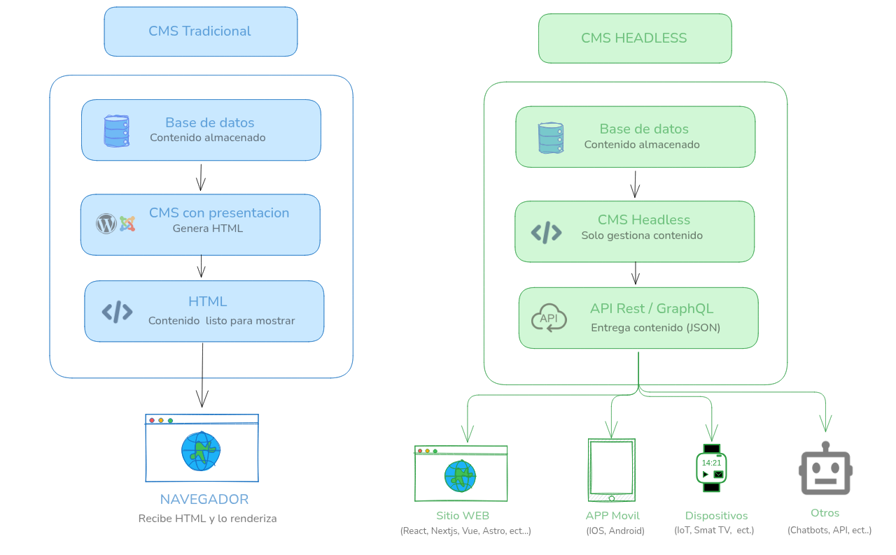
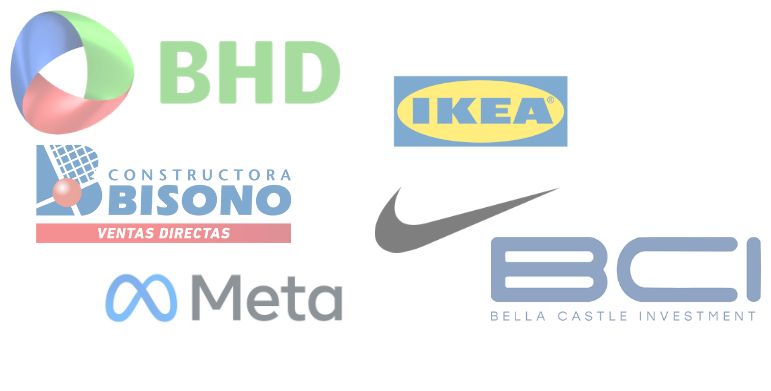

Hoy vamos a hablar sobre los CMS Headless y por qué cada vez más empresas lo usan, qué son y por qué son una buena opción para muchos proyectos.
En su definición más básica, un CMS Headless es un sistema de gestión de contenido que se caracteriza por desacoplar el contenido del frontend.
Piensa en ello como un backend especializado en contenido.

La principal diferencia con un CMS tradicional es que no tiene una capa de presentación integrada.
En lugar de generar HTML y entregarlo directamente al navegador, un CMS Headless proporciona contenido a través de una API.
Esto permite a los desarrolladores utilizar cualquier tecnología frontend para mostrar el contenido.

si te interesa conocer mas sobre los CMS headless te dejo estos articulos: 

<a href="https://aws.amazon.com/es/what-is/headless-cms/" target="_blank" rel="noopener">
    ¿Qué es un CMS Headless?
</a>
  

<a href="https://kontent.ai/headless-cms-guide/" target="_blank" rel="noopener">
    Guia para entender qué es un CMS Headless
</a>
  

Continuemos. Ahora te voy a mostrar un esquema de como funciona un CMS tradicional vs CMS Headless:

Como puedes ver en la imagen anterior, en un CMS tradicional todo esta acoplado: el CMS genera el HTML y lo entrega directamente al navegador.

En un CMS Headless, se genera el contenido y lo entrega a traves de una API, para que sea consumido por cualquier frontend.

Esto permite mostrar el contenido en websites, apps móviles, eCommerce, pantallas digitales, chatbots, sistemas de IA, o literalmente cualquier frontend.

A diferencia de un CMS tradicional como WordPress/Joomla/Drupal etc, donde el backend y el frontend viven pegados, aquí todo está desacoplado.

Y sinceramente… eso da muchísima libertad.

## ¿Por qué esto se volvió tan popular?

Porque las aplicaciones modernas ya no viven en un solo lugar, antes teniamos solamente la web, pero hoy en dia tenemos muchisimas plataformas y tecnologias.

Por ejemplo, un negocio antes tenía una web, ahora puede tener una web, una app móvil, panel administrativo, smart TVs, APIs públicas, integraciones externas, automatizaciones, asistentes de IA etc. Y como puedes imaginar, mantener el mismo contenido duplicado en todos lados termina siendo un caos.

Y es por eso que los CMS Headless han ganado tanta popularidad, porque te permiten escribir el contenido una sola vez y lo reutilizas donde quieras.

## ¿Cómo funciona?

Para responder a esta pregunta, debemos ver como es la arquitectura de un CMS Headless, normalmente tiene 3 partes:

### 1. Repositorio de contenido

Aquí es donde vive toda la información: artículos, imágenes, productos, configuraciones, videos, etc.

### 2. API

La API es quien entrega el contenido al frontend, generalmente usan APIs REST o GraphQL y el frontend simplemente consume los datos.

### 3. Frontend

Esta es la parte chula ya que aquí puedes usar literalmente cualquier tecnología como React, Next.js, Astro, Vue, Laravel, React Native, Flutter, etc, y eso es una de las cosas más interesantes del enfoque headless, te permite cambiar completamente el frontend sin tocar el contenido.

## Lo más interesante del enfoque headless

Para mí, y la cual considero una de las mayores ventajas es la libertad tecnológica, el hecho de no quedar atrapado en un template, un theme, un page builder o un sistema monolítico es realmente interesante, todo se vuelve mucho más flexible y escalable, especialmente para proyectos modernos y hacer un rediseño en el futuro es mucho más sencillo, porque no afecta el contenido.

## CMS Headless populares

Ahora hablemos de algunos CMS y servicios Headless populares:

* Strapi
* Payload CMS
* Sanity
* Directus
* Contentful

Pero la lista no termina aquí, ya que puedes usar tu propio backend o CMS tradicional y convertirlo en headless, por ejemplo WordPress, Joomla o Drupal. Aunque tradicionalmente no son headless, si se pueden usar de esa manera, por eso es importante entender el concepto.

## JAMstack y los CMS Headless

Quería hacer una pausa para explicarte qué es JAMstack.  JAMstack es un acrónimo que significa JavaScript, API y Markup. Es un enfoque de desarrollo web que utiliza tecnologías modernas para crear sitios web rápidos y seguros. Un sitio JAMstack se compone de:

* HTML
* JavaScript
* APIs

Lo menciono porque el enfoque JAMstack se apoya mucho de los CMS headless, ya que utilizan los CMS headless para obtener el contenido, y luego genera sitios estáticos que se pueden distribuir a través de una CDN, lo que resulta en sitios web muy rápidos y seguros. 

Te dejo un enlace para mas informacion sobre JAMstack y como funciona: <a href="https://jamstack.org/what-is-jamstack/" target="_blank" rel="noopener">Qué es JAMstack?</a>

## Casos donde esto tiene muchísimo sentido

Algunos ejemplos donde un CMS Headless brilla bastante:

* eCommerce
* blogs modernos
* apps móviles
* SaaS
* marketplaces
* sistemas multiidioma
* plataformas de cursos
* integraciones con IA
* automatizaciones
* microservicios

Cada uno tiene enfoques distintos.

Algunos son más developer-friendly.
Otros están más orientados a equipos de contenido.

## Empresas que usan CMS Headless

Aqui tienes algunos ejemplos de empresas que utilizan CMS Headless:

## Banco BHD

El <a href="https://bhd.com.do/" target="_blank" rel="noopener">Banco BHD</a> es uno de los bancos más grandes de la República Dominicana y utiliza un CMS Headless para gestionar su contenido. Ellos estan usando <a href="https://strapi.io/" target="_blank" rel="noopener">Strapi como CMS Headless</a> el cual permite mostrar el contenido en su pagina web y en su aplicacion movil.

Tambien te dejo un articulo con mas informacion sobre el caso de exito de BHD: <a href="https://strapi.io/user-stories/banco-bhd" target="_blank" rel="noopener">Caso de exito de BHD con Strapi </a>

este es un ejemplo solido de como se puede usar un CMS Headless en una empresa grande como lo es el banco BHD.

## Constructora Bisono

Otro ejemplo interesante en República Dominicana es <a href="https://constructorabisono.com.do/" target="_blank" rel="noopener">Constructora Bisonó</a>, una empresa con más de 57 años desarrollando proyectos de vivienda y apartamentos de interés social.

Su plataforma digital utiliza un enfoque Headless, donde <a href="https://es.wordpress.org/" target="_blank" rel="noopener">WordPress</a> funciona como CMS para la gestión del contenido y el frontend está desarrollado en <a href="https://angular.io/" target="_blank" rel="noopener">Angular</a>.

Este tipo de arquitectura les permite separar completamente la administración del contenido de la experiencia visual del sitio, logrando mayor flexibilidad, rendimiento y escalabilidad. Mientras el equipo puede gestionar proyectos, apartamentos y contenido desde WordPress, el frontend en Angular ofrece una experiencia moderna y dinámica para los usuarios.

Este caso demuestra cómo incluso empresas tradicionales del sector construcción están adoptando arquitecturas Headless para modernizar su presencia digital sin abandonar herramientas consolidadas como WordPress.

## BCI (Bella Castle Investment, SRL)

Otro caso moderno es <a href="https://www.bci.com.do/" target="_blank" rel="noopener">BCI</a>, una empresa del sector automovilístico con operaciones en República Dominicana y Jamaica que adoptó una arquitectura Headless utilizando <a href="https://www.sanity.io/" target="_blank" rel="noopener">Sanity</a> como CMS y <a href="https://nextjs.org/" target="_blank" rel="noopener">Next.js</a> para el frontend.

Este enfoque les permite manejar todo el contenido desde Sanity — incluyendo productos, servicios, sucursales y contenido corporativo — mientras que Next.js se encarga de entregar una experiencia rápida, moderna y optimizada para SEO.

La separación entre backend de contenido y frontend les facilita:

* Escalar el sitio rápidamente.
* Publicar contenido desde múltiples sedes.
* Mejorar el rendimiento y tiempos de carga.
* Tener una experiencia más flexible y mantenible.
* Prepararse para integraciones futuras como apps móviles o kioscos digitales.

BCI también destaca por su enfoque en innovación tecnológica dentro del sector automotriz, adaptándose constantemente a los cambios del mercado y expandiendo sus operaciones desde Santo Domingo hacia Santiago, Punta Cana y Jamaica.

Este es otro ejemplo de cómo empresas fuera del sector tecnológico están adoptando arquitecturas Headless modernas para construir plataformas digitales más rápidas, escalables y preparadas para crecimiento futuro.

## Conclusión

Honestamente…  después que entiendes el enfoque headless, empiezas a notar por qué tantas empresas grandes trabajan así.

No porque sea “moda”.

Sino porque:
* escala mejor
* da más libertad
* facilita reutilizar contenido
* hace más fácil evolucionar aplicaciones modernas

Y para developers que disfrutan construir cosas custom sin limitaciones raras…   definitivamente es una arquitectura demasiado interesante.

En el proximo post te voy a mostrar como convertir WordPress en un CMS Headless.

Hasta la proxima.
