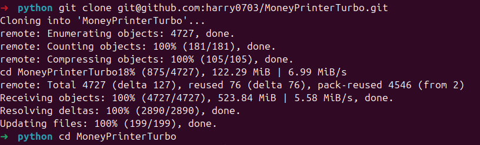
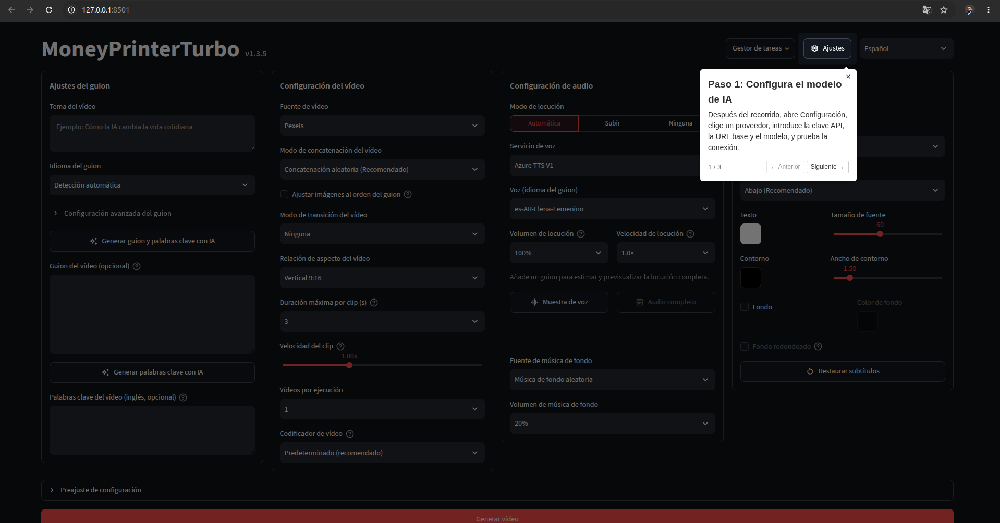
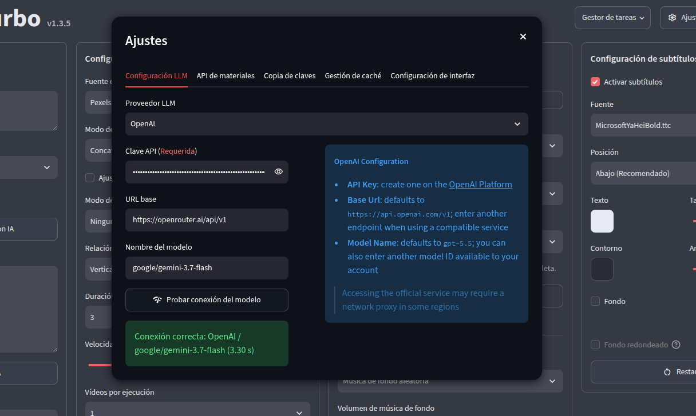
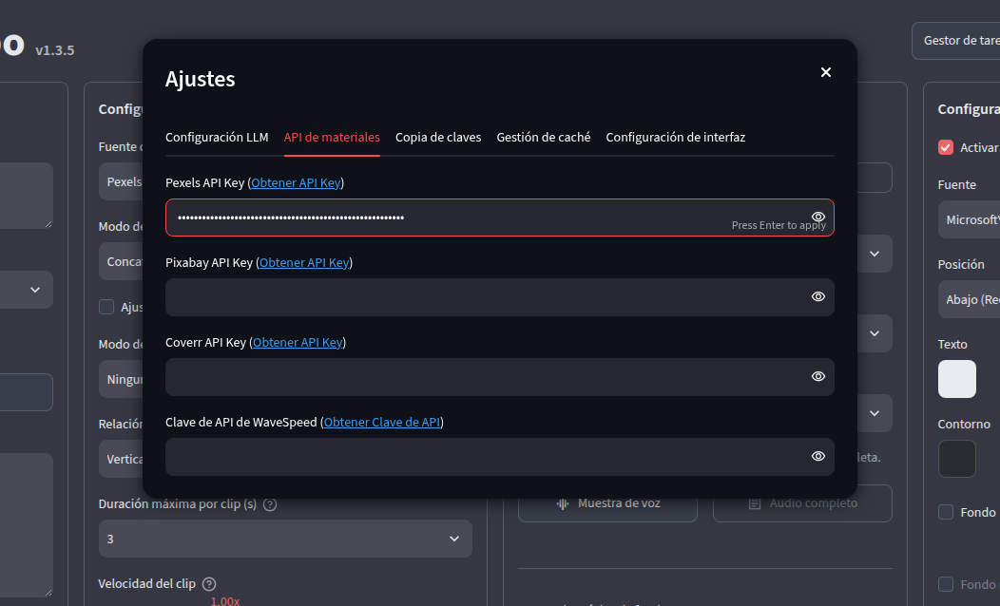
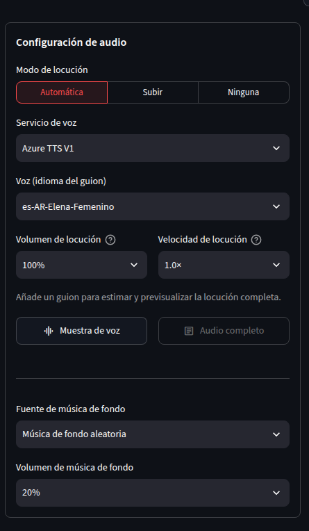
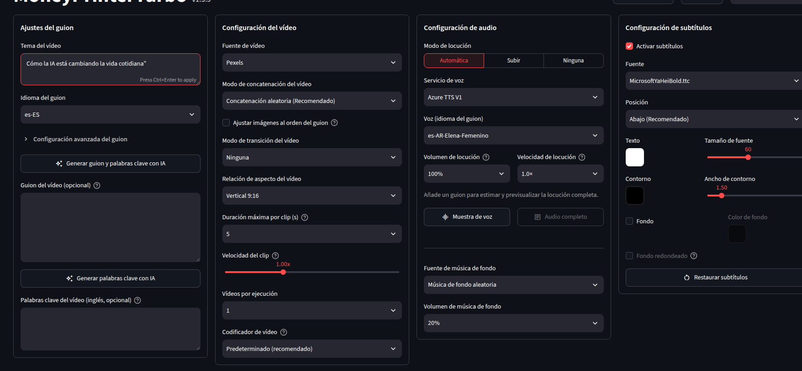
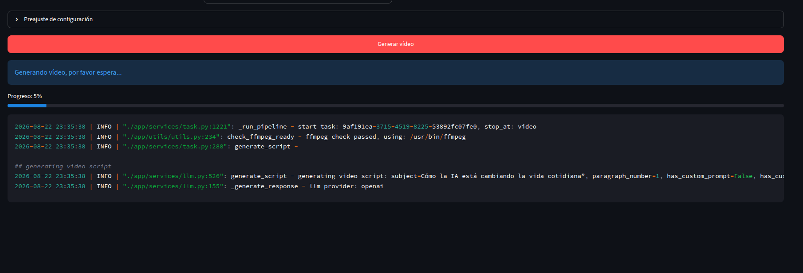
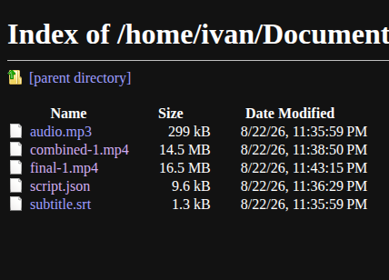

En mi post anterior te conté [qué es MoneyPrinterTurbo](/blog/moneyprinterturbo-generador-videos-cortos-ia) y todo lo que puede hacer: generar vídeos cortos completos —guion, imágenes, subtítulos y música— a partir de un simple tema, usando IA. Ahora toca ponerle las manos encima.

En este tutorial vamos a instalar el proyecto desde cero y generar nuestro primer vídeo, usando esta combinación:

- **LLM para el guion**: [OpenRouter](https://openrouter.ai/) (una pasarela unificada que te da acceso a decenas de modelos —GPT, Claude, Gemini, Llama, etc.— con una sola API key)
- **Gestor de entorno Python**: `uv`
- **Voz (TTS)**: Edge TTS (gratuita, no requiere API key)
- **Material audiovisual**: bancos gratuitos (Pexels / Pixabay)

Si prefieres otra combinación de proveedores, el proceso es prácticamente idéntico; solo cambia qué API key configuras.

## Requisitos previos

Antes de empezar, asegúrate de tener:

- **Python 3.11 o superior** instalado
- **[uv](https://docs.astral.sh/uv/)** instalado (el gestor de entornos y dependencias que usaremos)
- Una **API key de OpenRouter**, que puedes generar desde [openrouter.ai/keys](https://openrouter.ai/keys) (el registro es gratuito; solo pagas por los tokens que consumas según el modelo que elijas)
- Una **API key de Pexels** o **Pixabay** (ambas tienen planes gratuitos), para que MoneyPrinterTurbo pueda buscar clips relacionados con tu tema
- `git` instalado en tu sistema

> 💡 No necesitas GPU para este tutorial. Con una CPU de 4 núcleos y 4-8 GB de RAM es suficiente, ya que tanto el guion (vía OpenRouter) como la voz (Edge TTS) se procesan en la nube o de forma ligera.

## Paso 1: Clonar el repositorio

Abre una terminal y ejecuta:

```shell
git clone https://github.com/harry0703/MoneyPrinterTurbo.git
cd MoneyPrinterTurbo
```


## Paso 2: Instalar Python y las dependencias con uv

`uv` se encarga de instalar la versión correcta de Python y todas las dependencias del proyecto en un entorno aislado:

```shell
uv python install 3.11
uv sync --frozen
```

Este paso puede tardar un par de minutos la primera vez, ya que descarga todas las librerías necesarias.



## Paso 3: Preparar el archivo de configuración

MoneyPrinterTurbo crea automáticamente un `config.toml` a partir de `config.example.toml` en el primer arranque. Aunque también puedes configurarlo directamente desde la WebUI (que es lo que haremos aquí), es buena idea saber que este archivo existe por si luego quieres automatizar o versionar tu configuración.

## Paso 4: Levantar la WebUI

Con el entorno ya listo, lanza la interfaz web:

```shell
sh webui.sh
```

El script detecta automáticamente el entorno de `uv` y abre tu navegador por defecto. Si no se abre solo, la URL habitual es `http://127.0.0.1:8501`. Al abrirse, la interfaz también te ofrecerá un pequeño tour guiado para que te familiarices rápidamente con todas las opciones disponibles.



## Paso 5: Configurar OpenRouter como proveedor de LLM

MoneyPrinterTurbo soporta OpenRouter como un proveedor **compatible con la API de OpenAI**, así que la configuración se hace apuntando a su endpoint en lugar de usar una opción dedicada. Dentro de la WebUI, ve a la sección de **configuración básica** (Basic Settings) y:

1. Selecciona el proveedor de tipo **OpenAI-compatible / Custom**
2. En **Base URL**, coloca:
   ```text
   https://openrouter.ai/api/v1
   ```
3. En **API Key**, pega la key que generaste en `openrouter.ai/keys`
4. En **Model Name**, indica el modelo que quieres usar, por ejemplo:
   ```text
   google/gemini-3.7-flash
   ```
   o cualquier otro modelo disponible en el [catálogo de OpenRouter](https://openrouter.ai/models)
5. Guarda los cambios

Este modelo se encargará de escribir el guion del vídeo y de extraer las palabras clave que luego se usarán para buscar el material audiovisual.



## Paso 6: Configurar el banco de material audiovisual

En la misma sección de configuración, busca el apartado de **fuentes de material** (Video Source) y:

1. Selecciona **Pexels** o **Pixabay**
2. Pega tu API key correspondiente
3. Guarda los cambios



## Paso 7: Configurar la voz con Edge TTS

Edge TTS viene activado por defecto (aparece como **Azure TTS V1** en la interfaz) y no requiere ninguna API key, así que en principio no tienes que tocar nada aquí. Aun así, vale la pena entrar a la sección de voz para:

1. Elegir un idioma y una voz de la lista disponible
2. Escuchar la previsualización antes de generar el vídeo completo



## Paso 8: Generar tu primer vídeo

Con todo configurado, vuelve a la pantalla principal de generación y:

1. Escribe un **tema o palabra clave**, por ejemplo: *"Cómo la IA está cambiando la vida cotidiana"*
2. Elige el **formato**: vertical 9:16 (para Shorts/Reels/TikTok) u horizontal 16:9 (para YouTube)
3. Ajusta, si quieres, la **duración de los clips** y el **idioma del guion**
4. Haz clic en **Generar**



El proceso pasa por varias etapas —generación del guion con Gemini, búsqueda de clips, síntesis de voz con Edge TTS, generación de subtítulos y renderizado final— que puedes seguir en tiempo real desde la propia interfaz.



## Paso 9: Revisar el resultado

Cuando termine, se abrirá automáticamente una nueva pestaña en tu navegador mostrando el directorio con todos los archivos generados. Ahí encontrarás tu vídeo final listo para subir (usualmente llamado `final-1.mp4`), además del audio aislado, los subtítulos `.srt` y el guion.



Aquí puedes ver el resultado real que generó la herramienta:

<div class="flex justify-center my-8">
  <iframe width="560" height="315" src="https://www.youtube.com/embed/9Rbpk9JdjEU" title="YouTube video player" frameborder="0" allow="accelerometer; autoplay; clipboard-write; encrypted-media; gyroscope; picture-in-picture; web-share" allowfullscreen class="rounded-xl shadow-lg border border-white/10"></iframe>
</div>

## Algunos problemas comunes

- **`RuntimeError: No ffmpeg exe could be found`**: normalmente ffmpeg se descarga solo. Si falla, descárgalo manualmente desde [gyan.dev](https://www.gyan.dev/ffmpeg/builds/) y configura `ffmpeg_path` en `config.toml`.
- **`OSError: Too many open files`**: sube el límite de archivos abiertos con `ulimit -n 10240`.

## ¿Y ahora qué?

Con esto ya tienes tu primer vídeo generado de punta a punta con IA. A partir de aquí puedes experimentar con la generación por lotes para comparar varias versiones del mismo tema, probar otros proveedores de voz como ElevenLabs para un tono más natural, o configurar la publicación automática a TikTok, Instagram y YouTube Shorts para cerrar todo el flujo sin salir de la herramienta.