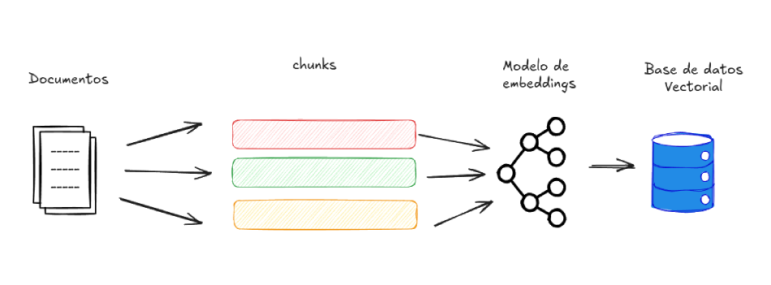
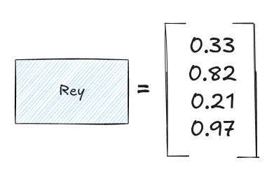
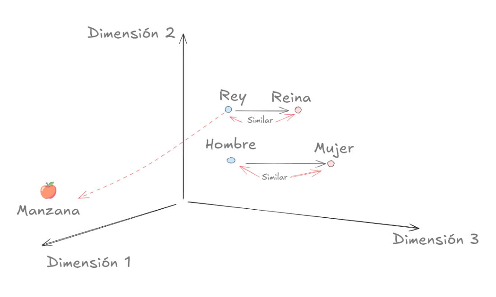
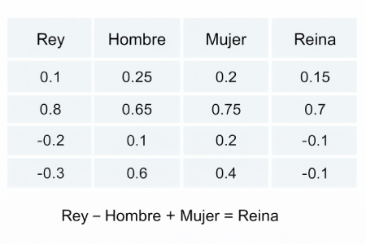

Hoy en día la inteligencia artificial está en todos lados, y cada vez más proyectos piden integrarla de alguna forma. Por eso, para los desarrolladores, ya no es solo una habilidad “extra”, sino algo que empieza a volverse parte del día a día. Entender conceptos como RAG no es solo teoría: es lo que te permite crear aplicaciones que realmente respondan bien, con información correcta y útil. Al final, la diferencia entre una demo que impresiona y un producto que funciona de verdad suele estar en qué tan bien sabes usar estas herramientas.

## ¿Qué es el RAG?

RAG (Retrieval-Augmented Generation) en español "generación aumentada por recuperación" es una técnica que combina modelos de lenguaje con sistemas de recuperación de información. En lugar de depender únicamente de lo que el modelo aprendió durante su entrenamiento, primero busca datos relevantes en una base de conocimiento externa —como documentos, bases de datos o archivos— y luego usa esa información como contexto para generar una respuesta. Esto permite obtener resultados más precisos, actualizados y confiables, especialmente en casos donde cometer errores o “alucinar” información tendría un costo alto.

Más info: [¿Qué es RAG (generación aumentada por recuperación)?](https://aws.amazon.com/es/what-is/retrieval-augmented-generation/)

Ahora bien, ¿cómo logra RAG encontrar información relevante? Aquí es donde entran en juego los embeddings, que son los que permiten comparar preguntas y documentos de forma matemática para saber cuáles se parecen más entre sí.

**Por ejemplo:**

Antes de responder, el modelo convierte la pregunta en números, consulta una base de datos de embeddings, selecciona los resultados más similares y se los pasa al modelo de lenguaje para que pueda generar la respuesta.

RAG funciona en dos fases principales: primero se prepara la información para que pueda ser buscada eficientemente, y luego se recuperan los datos más relevantes para generar una respuesta.
Empecemos por la primera fase: el indexing.

## Indexing

Lo primero que necesitamos es preparar la base de datos. Para hacerlo, tomamos documentos y los dividimos en pedacitos llamados chunks. Esto se hace por varias razones. Una de ellas es que cada pedacito (chunk) puede tener distinto nivel de relevancia dependiendo de la pregunta del usuario.

Además, muchos modelos tienen límites de ventana de contexto, por lo que dividir la información permite que el LLM pueda manejar grandes volúmenes de contenido aunque su contexto sea limitado.

Luego, cada uno de estos pedacitos pasa por un modelo de embeddings, y el resultado se guarda en una base de datos vectorial.

## Embedding

Usaremos la palabra “rey” Podríamos describirla por sus letras, pero eso no representa su significado real Los modelos de embeddings lo que hacen es convertir esa palabra en un vector, es decir, en una serie de números que representan su significado de forma matemática.

¿Por qué es una representación? Porque una vez convertidos en números, estos datos existen en un espacio vectorial. Imagina un espacio de tres dimensiones: los números que representan “rey” quedan más cerca de “reina” que de “manzana”. Esto tiene sentido porque, semánticamente, “rey” está más relacionado con “reina” que con “manzana”.

Incluso se pueden observar relaciones interesantes: por ejemplo, “hombre” y “mujer” mantienen una relación similar a la de “rey” y “reina” dentro de ese espacio vectorial. Este ejemplo está simplificado, pero ilustra cómo estos modelos capturan relaciones conceptuales reales.

De hecho, matemáticamente se puede observar algo curioso: si al vector de “rey” le restas “hombre” y le sumas “mujer”, el resultado se acerca mucho al vector de “reina”. Aunque es un ejemplo simplificado, demuestra cómo estos espacios vectoriales capturan relaciones semánticas.

Entonces, ¿qué tiene que ver esto con RAG? Que toda la información se representa como vectores numéricos para poder compararla rápidamente usando operaciones matemáticas.

## Retrieval + Generation (el flujo completo)

Una vez que los documentos están convertidos en *embeddings*, el siguiente paso es tomar la pregunta del usuario y convertirla también en números. Esto permite comparar su pregunta contra los datos almacenados.

Se calculan similitudes matemáticas entre el vector de la pregunta y los vectores de los *chunks* guardados. Luego se seleccionan los pedacitos (chunks) más parecidos, es decir, los más relevantes.

Cuando ya se eligieron los *chunks* relevantes, se le envían al modelo de lenguaje. El modelo usa esa información como contexto para responder la pregunta del usuario de forma precisa. Esta etapa corresponde al proceso de *generación*, mientras que la búsqueda previa se llama *retrieval*.

En conjunto, esto crea un flujo donde primero se recupera información relevante y después se genera una respuesta basada en ese contexto.

